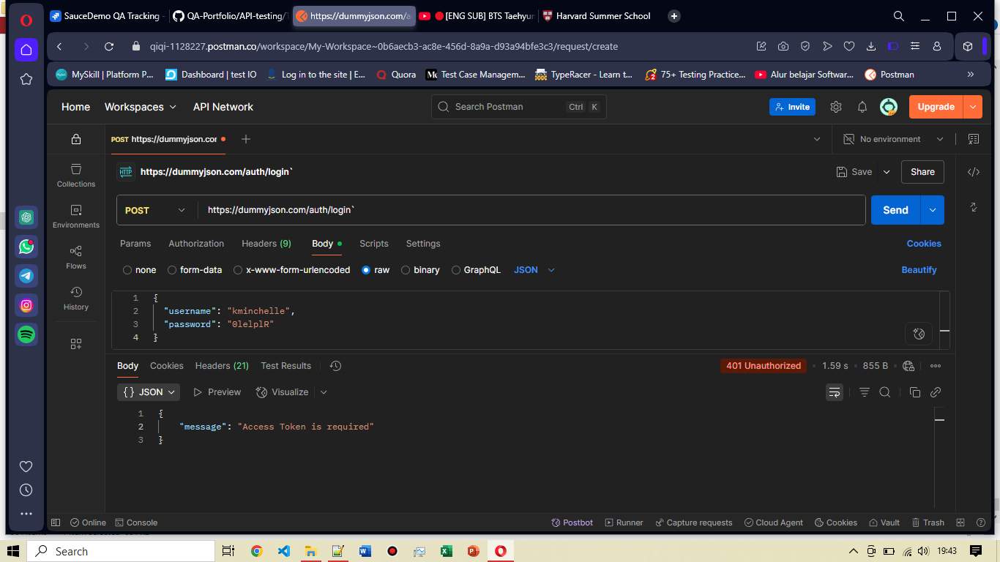

# TC-API-001: Login With Valid Credential (Access Denied)

**Endpoint:** https://dummyjson.com/auth/login`

**Method:** POST

**Request Body:**
```json
{
  "username": "kminchelle",
  "password": "0lelplR"
}

```

**Expected Result:**
- Status Code: `200 OK`
- Response Body:
```json

  "id": 15
  "username": "kminchelle",
  "email": "kminchelle@example.com",
  "token": "..."

```
**Actual Result:**
- Status Code: `401 Unauthorized`
- Response Body:
```json
{
  "message": "Access Token is required"
}
```
**Result:** Failed, login tidak bisa dijalankan karena flow tidak logis

**Issue:** [BUG] Berdasarkan actual result, ditemukan flow yang tidak logis: sistem meminta access token saat proses login, padahal seharusnya token diberikan setelah login berhasil. Hal ini menyebabkan user tidak dapat mengakses akun meskipun menggunakan kredensial yang valid.

**Attachment:**

