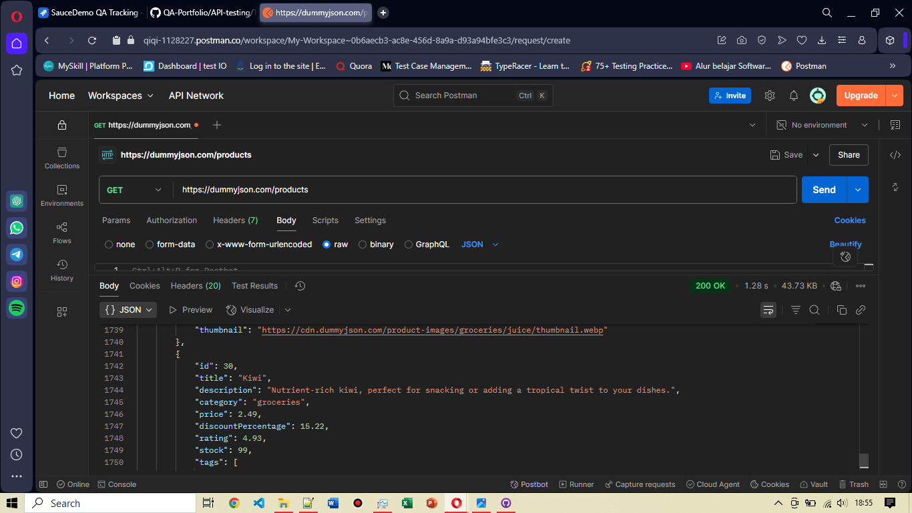

# TC-API-002: Get All Products (GET)

**Endpoint:** `https://dummyjson.com/products`

**Method:** GET

**Expected Result:**
- Status Code: `200 OK`
- Response berupa list produk (limit default: 30 item)
- Terdapat properti seperti `id`, `title`, `price`, `brand`, `category`

**Actual Result:**
- Status: `200 OK`
- Response sesuai ekspektasi yaitu berupa list produk beserta propertinya 

**Attachment:**

