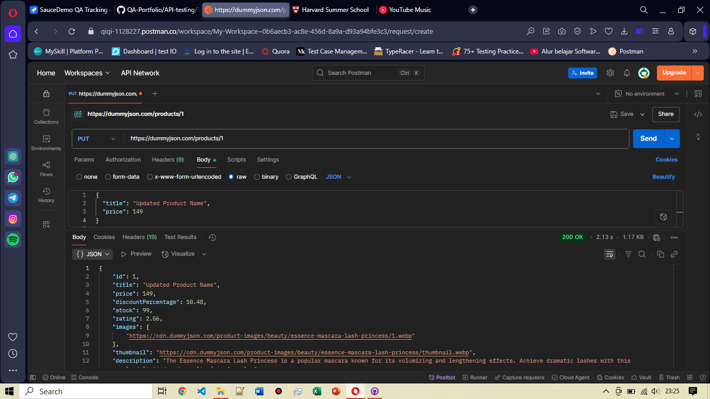

# TC-API-004: Update Produk yang Sudah Ada (PUT) 

**Endpoint:** https://dummyjson.com/products/1

**Method:** PUT

**Request Body:**

```json
{
  "title": "Updated Product Name",
  "price": 149
}

```

**Expected Result:**
- Status Code: `200 OK`
- Response Body: Menampilkan data produk yang berhasil di-update

**Actual Result:**
- Passed, as expected data berhasil di-update dan status code sesuai yaitu `200 Ok`
  
**Attachment:**



