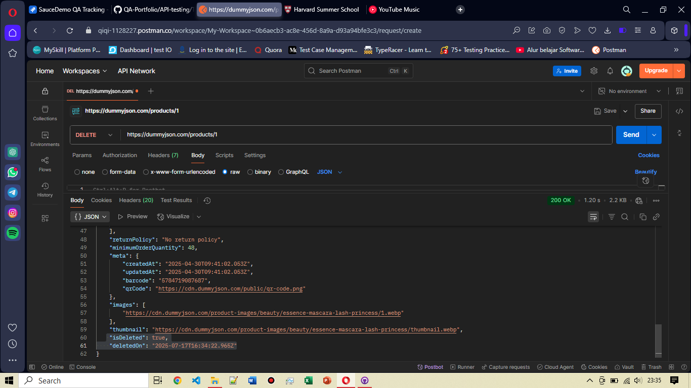

# TC-API-005: Hapus Produk yang Sudah Ada

**Endpoint:** https://dummyjson.com/products/1

**Method:** DELETE

**Expected Result:**
- Status Code: `200 OK`
- Response Body: Menampilkan bahwa data produk yang dipilih berhasil dihapus dalam format raw json

**Actual Result:**
- Passed, as expected data terpilih berhasil dihapus dan status code sesuai yaitu `200 OK`
  
**Attachment:**

