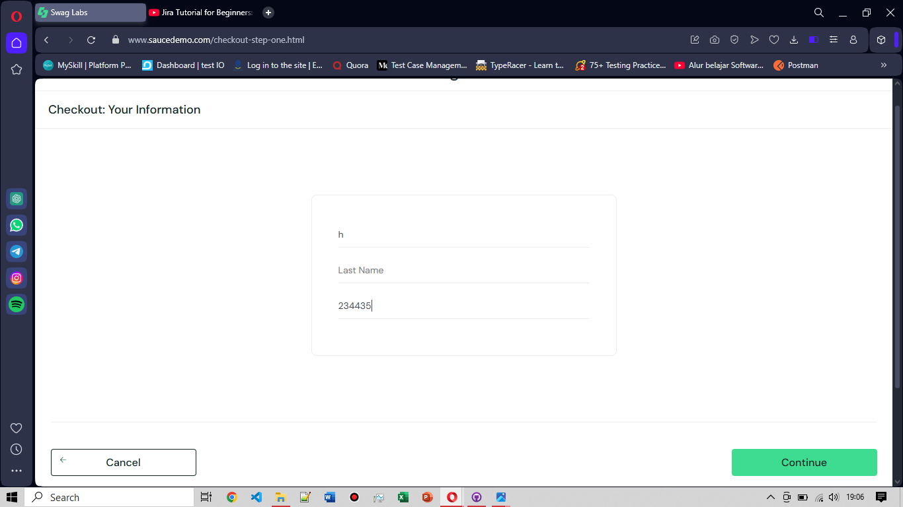

# BG-FC-003: Last Name Column Not Filled on Checkout Information Page

**Severity:** Critical

**Environment:** OS Windows 10, Browser Opera v119

**Pre-condition:** User telah login menggunakan username: `problem_user` dan berada di halaman cart

**Steps to Reproduce:**
1. Klik tombol **Checkout** setelah memilih produk yang akan dibeli
2. Isi form data diri yang terdiri dari: First Name, Last Name, dan Zip/Postal Code
3. Klik tombol **Continue** untuk melanjutkan proses checkout

**Expected Result:** User dapat mengisi  diri lengkap dan melanjutkan ke tahap pembayaran

**Actual Result:** Terjadi error pada kolom **Last Name**. Sistem secara otomatis mengisi kolom **First Name** di posisi kolom Last Name, sehingga input Last Name kosong. Akibatnya, user tidak dapat melanjutkan ke tahap pembayaran meskipun tampak semua kolom telah diisi.

**Attachment:**
|Di Halaman Cart| Di Halaman Checkout (before)| Di halaman Checkout (after)|
|---------------|-----------------------------|----------------------------|
||||
