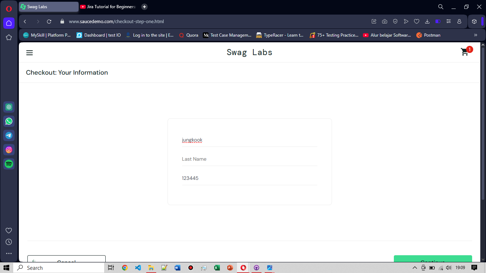

# BG-FC-003: Last Name Column Not Filled on Checkout Information Page

**Severity:** Critical

**Environment:** OS Windows 10, browser Opera v119

**Pre-condition:** User telah login menggunakan username: problem_user dan berada di halaman cart

**Steps to Reproduce:**
1. Berada di halaman cart yang berisi beberapa produk terpilih, klik "Checkout"
2. Berada di halaman checkout, isi data diri sebelum melanjutkan
3. Isi data diri, yang terdiri dari: First Name, Last Name, dan Zip/Postal Code
4. Setelah mengisi data diri lengkap, klik "Continue"

**Expected Result:** User dapat mengisi  diri lengkap dan melanjutkan ke tahap pembayaran

**Actual Result:** Terdapat error pada kolom "Last Name" pada saat mengisi data diri di halaman Checkout, yaitu kolom "Last Name" tidak terisi dan sistem otomatis mengisi kolom "First Name".  Hal ini menyebabkan user tidak bisa melanjutkan ke tahap pembayaran meskipun semua data seolah sudah diisi

**Attachment:**
|Di Halaman Cart| Di Halaman Checkout (before)| Di halaman Checkout (after)|
|---------------|-----------------------------|----------------------------|
||||
