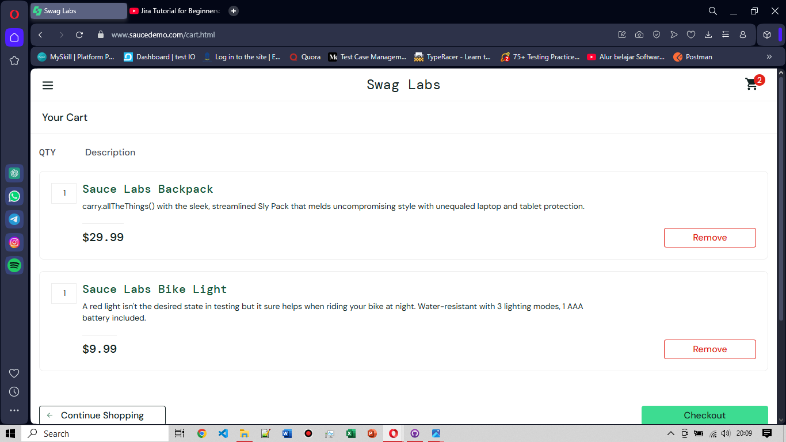
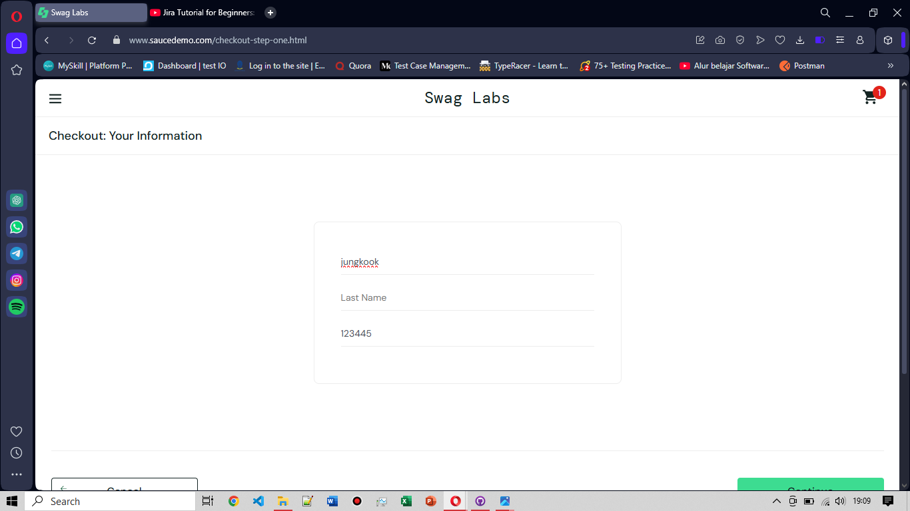
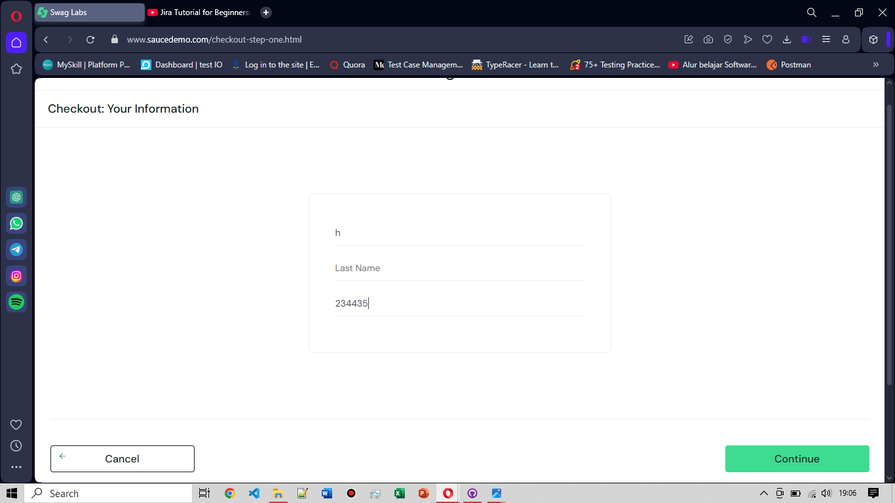

# BG-FC-003: Fail to Field the Column on Checkout Informations Page

**Severity:** Critical

**Environment:** OS Windows 10, browser Opera v119

**Pre-condition:** Berada di halaman cart & telah login dengan username: problem_user & password: secret_sauce

**Steps to Reproduce:**
1. Berada di halaman cart yang berisi beberapa produk terpilih, klik "Checkout"
2. berada di halaman checkout, isi data diri sebelum melanjutkan
3. Isi data diri, yang terdiri dari: First Name, Last Name, dan Zip/Postal Code
4. Setelah mengisi data diri lengkap, klik "Continue"

**Expected Result:** User dapat mengisi dapat diri lengkap dan melanjutkan ke tahap pembayaran

**Actual Result:** Terdapat error pada kolom "Last Name" pada saat mengisi data diri di halaman Checkout, yang mengakibatkan tidak dapat melanjutkan ke proses pembayaran

**Attachment:**
|Di Halaman Cart| Di Halaman Checkout (before)| Di halaman Checkout (after)|
|---------------|-----------------------------|----------------------------|
||||
