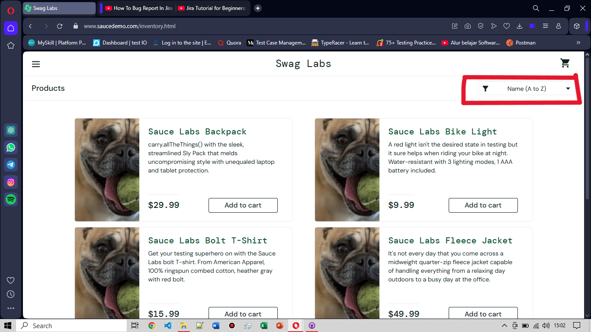
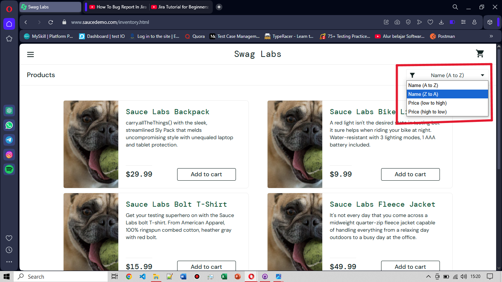

# BG-FC-002: Filter Product Not Working on Product Page

**Severity:** Major

**Environment:** OS Windows 10, Browser Opera v119

**Pre-condition:** User sudah login dengan username: problem_user dan berada di halaman produk

**Steps to Reproduce:**
1. User telah login dan berada di halaman produk
2.  Klik tombol Filter di pojok kanan atas, di bawah tombol cart
3. Pilih salah satu filter (misalnya: sort by A-Z atau sort by Price low to high)
   
**Expected Result:** Produk yang ditampilkan seharusnya berubah sesuai filter yang dipilih

**Actual Result:** Tidak ada perubahan yang terjadi setelah menekan tombol filter yang dipilih

**Attachment:**
|Before|After|
|--------------------------|--------------------------|
|||
