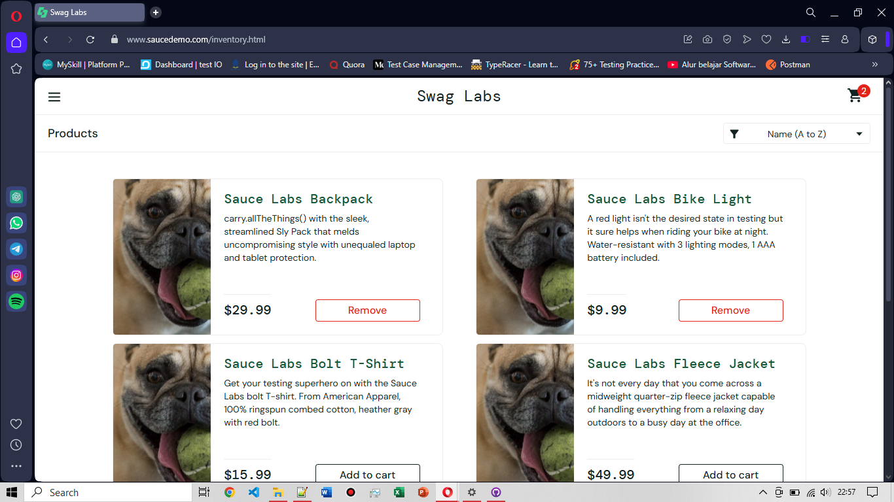

# BG-FC-001: [BUG] "Remove" Button Not Working on Products Page (Cart Not Updated)

**Severity:** Major

**Environment:** OS Windows 10,  Browser Opera v119

**Pre-condition:** User telah login menggunakan username: `problem_user` dan berada di halaman produk

**Steps to Reproduce:**
1. Tambahkan satu atau beberapa item ke cart
2. Klik **Remove** pada item yang ingin dihapus 
   
**Expected Result:** Produk dihapus dari cart dan ikon jumlah item di cart (pojok kanan atas) berkurang sesuai jumlah yang dihapus.

**Actual Result:** Tombol **Remove** tidak memberikan respon. Produk tidak terhapus dari cart dan jumlah item tetap.

**Attachment:**
|Remove Button Not Working on Product Page|
|-----------------------------------------|
||
