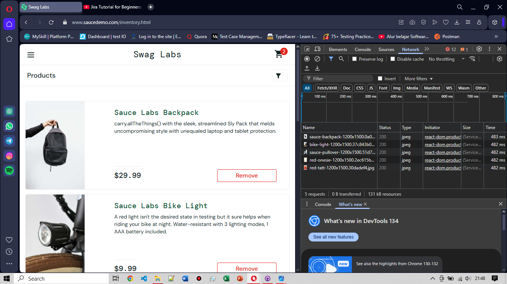

# BG-PR-001: Product Image Loads Too Slowly Without Loading Indicator

**Severity:** Minor  

**Environment:** OS Windows 10, Opera v119  

**Pre-condition:** Berada di halaman login menggunakan username: `performance_glitch_user` 

**Steps to Reproduce:**
1. Setelah berhasil login, user diarahkan ke halaman produk
2. Amati waktu munculnya gambar-gambar produk

**Expected Result:**  
Semua gambar produk ditampilkan dalam waktu <1 detik, atau sistem menampilkan indikator loading saat gambar belum siap

**Actual Result:**  
Gambar-gambar produk butuh ~482 ms masing-masing untuk dimuat (total ~2.4 detik untuk semua gambar), dan halaman tampak kosong beberapa saat tanpa loading indicator

**Evidence:**
- Network panel di DevTools menunjukkan masing-masing gambar membutuhkan waktu 482–483 ms untuk load
- Tidak ada animasi atau loader icon selama proses ini berlangsung

**Impact:**  
- User bisa merasa halaman lambat/tidak responsif karena gambar tidak langsung tampil
- Bisa dianggap aplikasi “blank” oleh user dengan koneksi lambat

**Attachment:**
|Evidence|
|--------|
||
