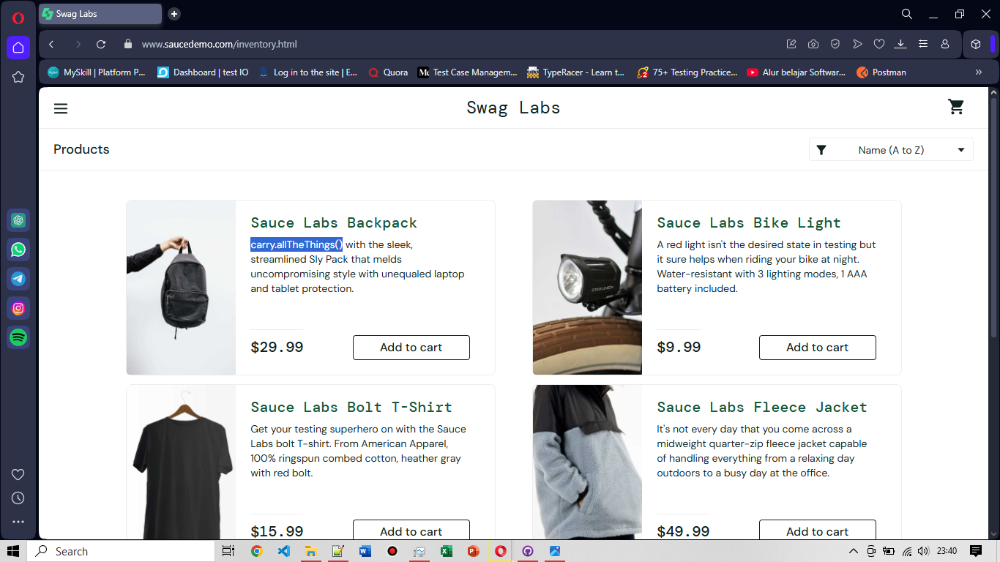

# BG-UI-001: [BUG] Login Performance UI

**Severity:** Minor

**Environment:** OS Windows 10, Browser Opera v119

**Pre-condition:** User berada di halaman login
**Steps to Reproduce:**
1. Input username valid: performance_glitch_user
2. Input password: secret_sauce
3. Klik tombol Login atau Enter
   
**Expected Result:** Berhasil masuk ke halaman produk tanpa defect UI

**Actual Result:** Berhasil masuk ke halaman produk dengan defect UI pada beberapa nama produk

**Attachment:**
| Login Data Valid | UI Product Defect |
|------------------|-------------------|
|| |
