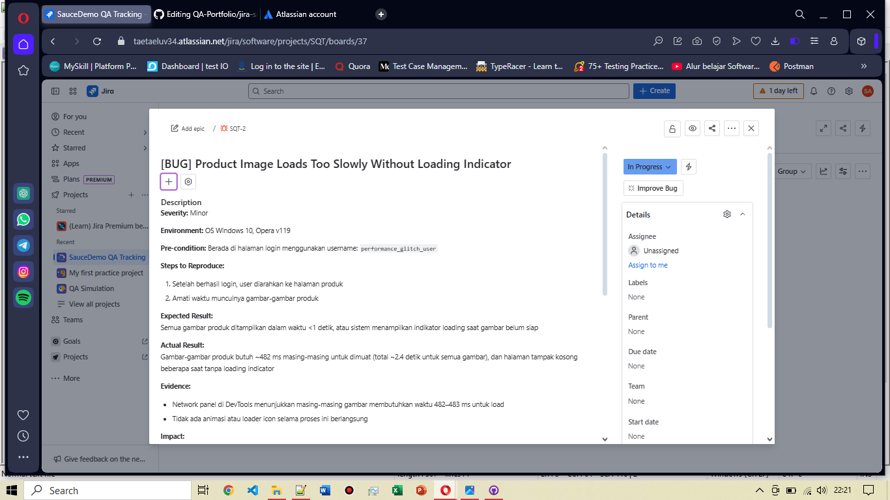

# Jira Ticket: [BUG] Product Image Loads Too Slowly Without Loading Indicator

**Ticket ID:** SQT-2
**Status:** In Progress 
**Issue Type:** Bug  
**Project:** SauceDemo Bug Tracking  
**Created by:** Sasqiana  
**Created on:** [12 Juli 2025]

---

## Bug Description

Gambar-gambar produk butuh ~482 ms masing-masing untuk dimuat (total ~2.4 detik untuk semua gambar), dan halaman tampak kosong beberapa saat tanpa loading indicator.

📎 Lihat bug report lengkap di sini:  
[BG-UI-002: [BUG] Typo pada Nama dan Deskripsi Produk](https://github.com/Sasqiana/QA-Portfolio/blob/main/bug-reports/ui-bug/typo-at-products-page.md)

---

## Jira Board View

