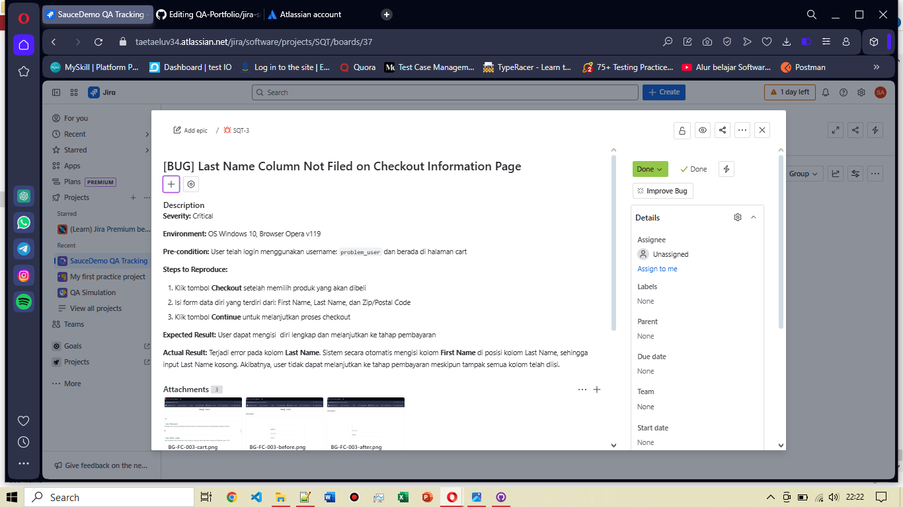

# Jira Ticket: [BUG]  Last Name Column Not Filed on Checkout Information Page

**Ticket ID:** SQT-3
**Status:** Done
**Issue Type:** Bug  
**Project:** SauceDemo Bug Tracking  
**Created by:** Sasqiana  
**Created on:** [12 Juli 2025]

---

## Bug Description

Terjadi error pada kolom Last Name. Sistem secara otomatis mengisi kolom First Name di posisi kolom Last Name, sehingga input Last Name kosong. Akibatnya, user tidak dapat melanjutkan ke tahap pembayaran meskipun tampak semua kolom telah diisi.

Lihat bug report lengkap di sini:  

[BG-FC-003: [BUG] Last Name Column Not Filed on Checkout Information Page](https://github.com/Sasqiana/QA-Portfolio/blob/main/bug-reports/functional-bug/fail-to-field-the-column.md)

---

## Jira Board View

