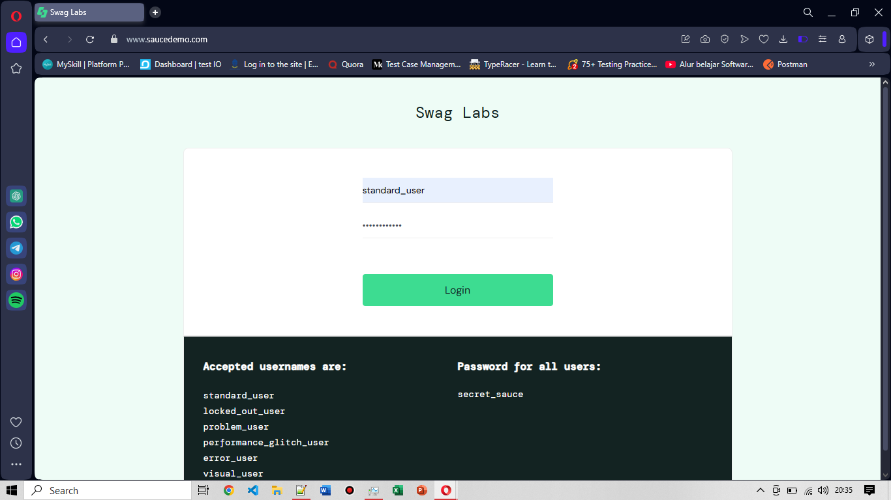
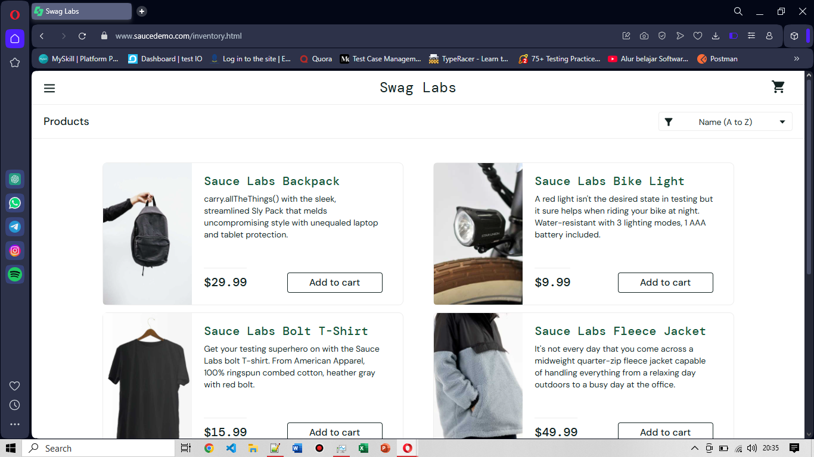

# SD-LG-001: Login dengan Kredensial Valid

**Pre-condition:**
User berada di halaman login

**Steps:**
1. Input username valid: standard_user
2. Input password valid: secret_sauce
3. Klik tombol Login atau Enter

**Expected Result:**
User masuk ke halaman  produk

**Actual Result:**
PASSED, as expected. User berhasil masuk ke halaman produk

**Post Condition:**
User berada di halaman  produk dalam keadaan login

**Documentation:**

