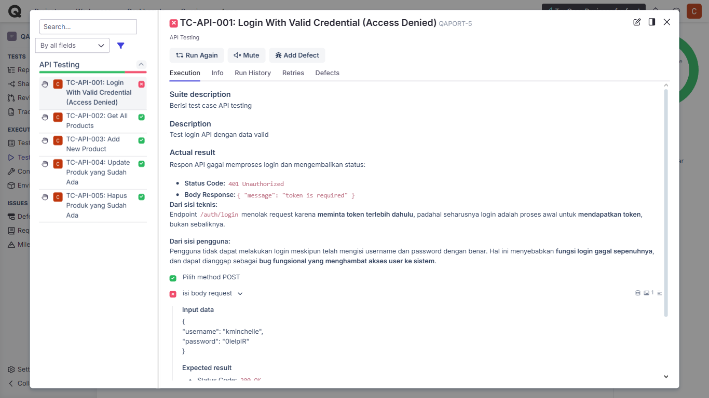
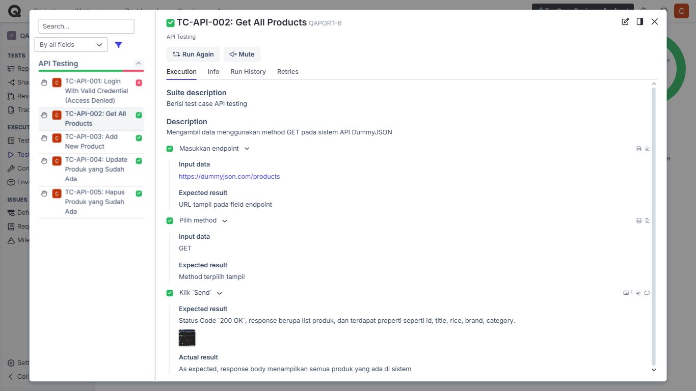
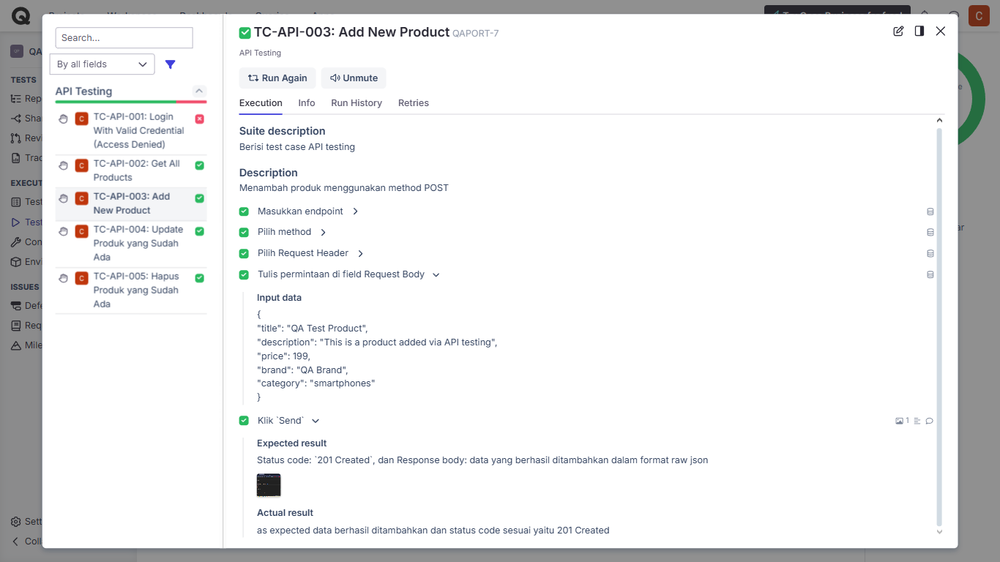
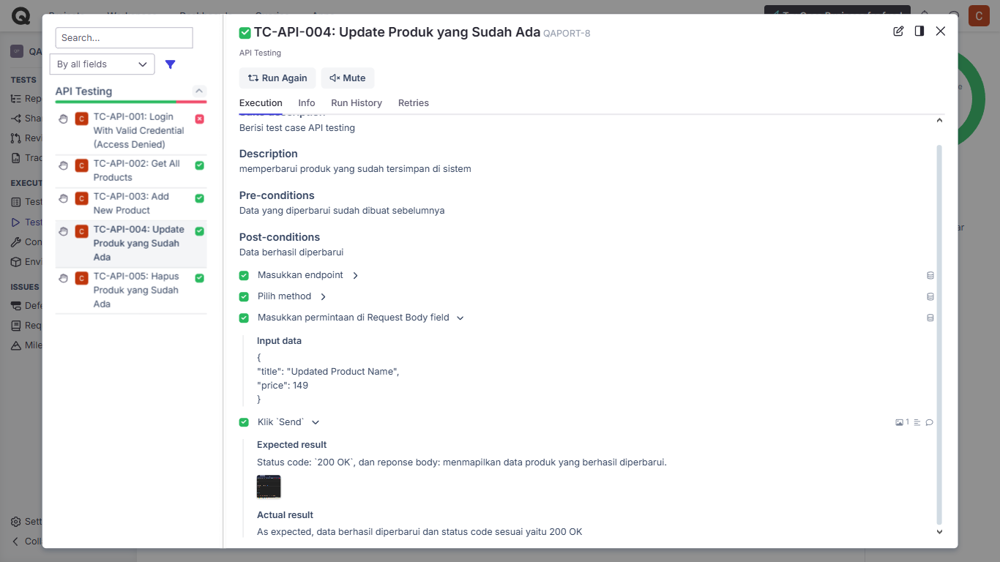
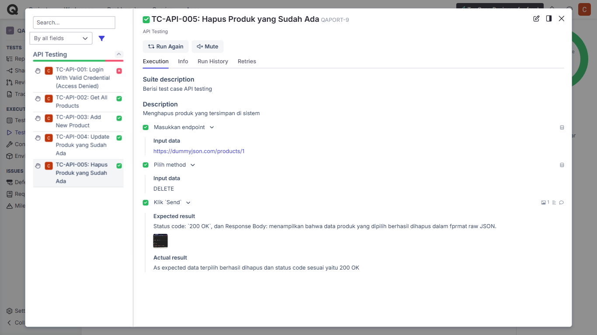

# Qase Test Run Log – API Testing (DummyJSON)

**Project Name:** SauceDemo QA Project  
**Test Suite:** API-Testing     
**Test Run Name:** API Testing Run        
**Tester:** Sasqiana        
**Date:** 26 July 2025

---

## Test Case Summary

| TC-ID          | Title                          | Status      | Notes                |Title                                                    |
|----------------|--------------------------------|-------------|----------------------|---------------------------------------------------------|
| TC-API-001     | Login With Valid Credential    | ❌ Failed   | API response: 401    | |
| TC-API-002     | Get All Products               | ✅ Passed   | Data returned normal | |
| TC-API-003     | Create New Product (POST)      | ✅ Passed   | Product created      | |
| TC-API-004     | Update Product (PUT)           | ✅ Passed   | Product updated      | |
| TC-API-005     | Delete Product (DELETE)        | ✅ Passed   | Product deleted      | |

---

## Test Result Summary:
- **Total**: 5 test cases  
- **Passed**: 4  
- **Failed**: 1 (login - access denied)  
- **Blocked/Skipped**: 0  

---

📝 **Kesimpulan**:  
Pengujian API DummyJSON berhasil dijalankan dengan total 5 skenario. Semua berhasil **kecuali login**, karena endpoint saat ini tidak mengizinkan akses (kemungkinan tidak aktif atau butuh token). Hal ini dicatat sebagai catatan penting (bukan bug dari kita).

